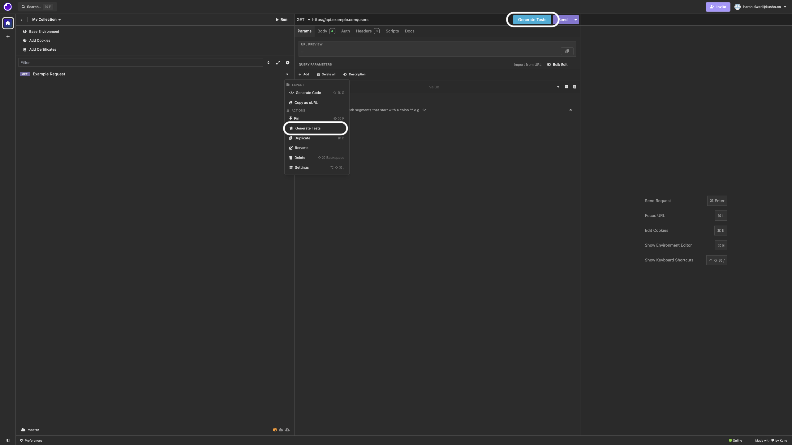
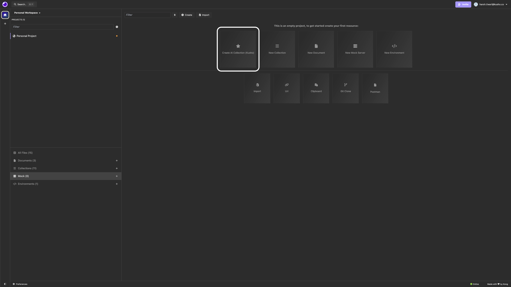
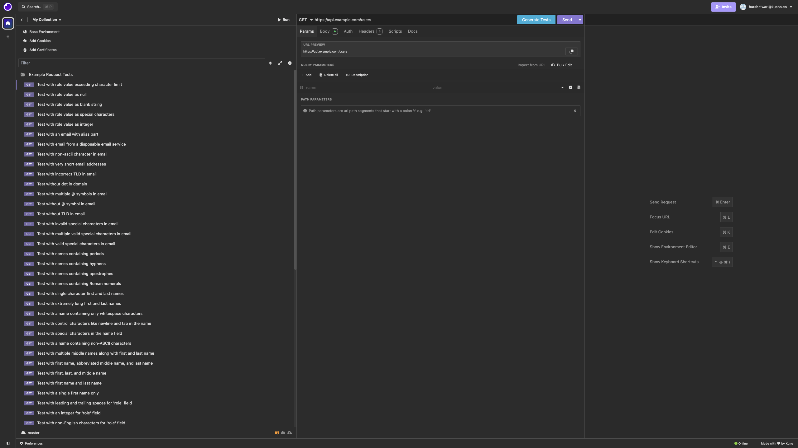

# Insomnia API Client

[](https://insomnia.rest)


[](https://chat.insomnia.rest/)
[](LICENSE)


Insomnia is an open-source, cross-platform API client for GraphQL, REST, WebSockets, Server-sent events (SSE), gRPC and any other HTTP compatible protocol.

With Insomnia you can:

- **Debug APIs** using the most popular protocols and formats.
- **Design APIs** using the native OpenAPI editor and visual preview.
- **Test APIs** using native test suites and collection runner.
- **Mock APIs** using a cloud or self-hosted mocking server.
- **Build CI/CD pipelines** using the native Insomnia CLI for linting and testing.
- **Collaborate with others** using the many collaboration features.
- **And more** including the ability to use 3rd party plugins.

The following storage options are supported for your Insomnia projects, collections, design specs and all other resources:

- **Local Vault**: for 100% local storage of collections, design specs and every other resource.
- **Git Sync**: for Git storage using any 3rd party Git repository, without going through the cloud.
- **Cloud Sync**: for cloud collaboration, optionally end-to-end encrypted (E2EE) in the cloud.


This Kusho's fork implementation of Insomnia now includes powerful AI-driven test generation capabilities that automatically create comprehensive test suites for your API endpoints.

### Getting Started with Test Generation

There are two main ways to generate API tests in Insomnia with our Kusho AI implementation:

#### 1. Generate Tests for Existing Requests
- Open your API request
- Click the blue "Generate Tests" button or use the request dropdown menu (⋮ → ACTIONS → Generate Tests)
- The AI will create a new folder with comprehensive test cases



#### 2. Create an AI Test Collection (New!)
1. From the main dashboard, click "Create AI Collection (Kusho)"
2. Enter your API details:
   - Base URL
   - Endpoints
   - Authentication requirements
   - Expected payload formats
3. Click "Generate Tests" to automatically:
   - Create a new collection
   - Generate appropriate requests
   - Create comprehensive test suites for each endpoint



### Test Organization

When tests are generated (either way), Insomnia will:
1. Create a new folder named "[Your Request Name] Tests"
2. Generate individual request tests inside this folder
3. Name each test descriptively based on what it's testing



### Types of Generated Tests

Our implementation leverages Kusho's state-of-the-art AI model to generate comprehensive API test suites. The AI model has been specifically trained to understand REST API patterns, edge cases, and security considerations, generating tests that cover:

### Input Validation Testing
- Empty string validations for required fields
- Boundary testing for string lengths and numeric values
- Special character handling in input fields (`$`, `%`, `@`, `#`, etc.)
- Non-English character validation (UTF-8 encoding tests)
- Case sensitivity tests (lowercase, uppercase, mixed case)
- Leading/trailing whitespace validation

### JSON Structure Testing
- Missing required fields in JSON objects
- Extra/unexpected fields in payloads
- Nested object validation
- Array handling and validation
- Integer vs string type mismatches
- Null value handling
- Extremely long JSON objects
- Malformed JSON structures

### HTTP Method Validation
- Wrong HTTP method usage
- Method not allowed scenarios
- HEAD/OPTIONS request validation
- Method override attempts

### Security-Focused Tests
- SQL injection pattern detection
- Basic XSS payload testing
- Special character security validation
- Token/authentication field validation
- Role-based access scenarios

### Performance Edge Cases
- Large payload testing
- Long string inputs
- High Unicode character counts
- Deeply nested JSON structures
- Multiple concurrent requests

### Field-Specific Intelligence
- Email format validation
- Date format testing
- Phone number format checking
- URL encoding validation
- Role field permission testing
- ID field format validation

The AI model has been trained on millions of API endpoints and common testing patterns, allowing it to:
- Identify field types and generate appropriate test cases
- Understand API conventions and best practices
- Detect potential security vulnerabilities
- Generate relevant boundary test cases
- Create meaningful validation scenarios

Each generated test includes:
- Descriptive name explaining the test purpose
- Appropriate HTTP method configuration
- Relevant test data and payloads
- Expected response validation criteria
- Necessary headers and authentication settings

### Benefits of AI Collection Generation

- **Quick Start**: Instantly create complete test suites for new APIs
- **Comprehensive Coverage**: AI automatically identifies all testable scenarios
- **Structured Organization**: Tests are logically grouped by endpoint and test type
- **Ready to Run**: All tests are pre-configured and ready to execute
- **Customizable**: Generated tests can be modified to suit specific needs

The AI collection generator is perfect for:
- Starting new API testing projects
- Creating baseline test coverage
- Generating regression test suites
- Exploring edge cases and security scenarios

The test generation is powered by Kusho's latest AI model iteration, which has been fine-tuned specifically for API testing scenarios and maintains a continuously updated understanding of API security best practices and validation requirements.

Let me know if you'd like me to adjust any part of this documentation or provide more specific details about certain features!ent](https://raw.githubusercontent.com/Kong/insomnia/develop/screenshots/main.png)

## Get started for free

Insomnia is available for Mac, Windows, and Linux and can be downloaded from the website:

**[https://insomnia.rest](https://insomnia.rest)**

## Account & Subscriptions

You can use Insomnia without an account with the local **Scratch Pad**, or you can [create an account for free](https://insomnia.rest/pricing) to get access to the full capabilities of the product.

Even with an account, Insomnia only stores your projects and files accordingly to the **storage backend** that you have selected, which can be Local Vault, Cloud Sync, Git Sync or any combination of them. As such - for example - you have the freedom to choose to store sensitive projects 100% locally or in a Git repository, while still being able to collaborate on others in the cloud. It's the best of both worlds.

For added security, Insomnia also offers a **Private Environments** feature, where your environments configuration is always stored locally and never in the cloud, independently from the storage option that you have chosen for your project.

## Premium features and support

Insomnia has a very generous free plan that will be satisfactory for most users, but if you need to get access to premium capabilities like unlimited collaboration, the Git Sync feature, the ability to create organizations for your projects, using a 3rd party IDP for logins (SAML, OIDC) and many other features, then you can explore the other subscription plans.

You can [compare all subscription plans](https://insomnia.rest/pricing) and get started for free.

## Why does Insomnia require an account?

Insomnia does not require an account if you decide to use the local **Scratch Pad**, but to access most capabilities of the product we require an account. Your account data is securely stored in compliance with ISO27001, SOC 2 Type II, ISO27018, Gold CSA STAR regulations and in accordance to our terms of service and privacy policy.

We require an account to sustainably build and improve the product, and to make sure we can continue to offer the many core capabilities in a free and open-source distribution. While open source software is free to use, it is unfortunately not free to build, and our ability to continue working on Insomnia is dependent on our ability to convert a subset of free users (that need premium features) to become paying customers of our product.

If you are a user that cannot share API data like collections and design specifications to the cloud, this is still possible by selecting "Local Vault" as the storage of your Insomnia projects: having an Insomnia account is not tied to how you wish to store your sensitive API data (which can be stored 100% locally via Local Vault, on a 3rd party Git repository without any cloud storage via Git Sync, or in the cloud for ease of collaboration via Cloud Sync).

## Bugs and Feature Requests

Have a bug or a feature request? First, read the
[issue guidelines](CONTRIBUTING.md#using-the-issue-tracker) and search for existing and closed issues. If your problem or idea is not addressed yet, [please open a new issue](https://github.com/Kong/insomnia/issues).

For more generic product questions and feedback, join the [Slack Team](https://chat.insomnia.rest).

## Contributing

Please read through our [contributing guidelines](CONTRIBUTING.md) and [code of conduct](CODE_OF_CONDUCT.md). Included are directions for opening issues, coding standards, and notes on development.

## Documentation

Check out our official [Insomnia Documentation](https://docs.insomnia.rest/).

## Develop Insomnia

Development on Insomnia can be done on Mac, Windows, or Linux as long as you have [Node.js](https://nodejs.org) and [Git](https://git-scm.com/). See the `.nvmrc` file located in the project for the correct Node version.

<details>
<summary>Initial Dev Setup</summary>

This repository is structured as a monorepo and contains many Node.JS packages. Each package has its own set of commands, but the most common commands are available from the root [`package.json`](package.json) and can be accessed using the `npm run …` command. Here are the only three commands you should need to start developing on the app.

```shell
# Install and Link Dependencies
npm i

# Run Lint
npm run lint

# Run type checking
npm run type-check

# Run Tests
npm test

# Start App with Live Reload
npm run dev
```

### Linux

If you are on Linux, you may need to install the following supporting packages:

<details>
<summary>Ubuntu/Debian</summary>

```shell
# Update library
sudo apt-get update

# Install font configuration library & support
sudo apt-get install libfontconfig-dev
```

</details>

<details>
<summary>Fedora</summary>

```shell
# Install libcurl for node-libcurl
sudo dnf install libcurl-devel
```

</details>

Also on Linux, if Electron is failing during the install process, run the following

```shell
# Clear Electron install conflicts
rm -rf ~/.cache/electron
```

### Windows

If you are on Windows and have problems, you may need to install [Windows Build Tools](https://github.com/felixrieseberg/windows-build-tools)

</details>

<details>
<summary>Editor Requirements</summary>

You can use any editor you'd like, but make sure to have support/plugins for the following tools:

- [ESLint](http://eslint.org/) - For catching syntax problems and common errors
- [JSX Syntax](https://facebook.github.io/react/docs/jsx-in-depth.html) - For React components

</details>

## Develop Inso CLI

- `npm i`
- Start the compiler in watch mode: `npm run inso-start`
- Run: `./packages/insomnia-inso/bin/inso -v`

## Plugins

Search for, discover, and install plugins from the Insomnia [Plugin Hub](https://insomnia.rest/plugins/)!

## Community Projects

- [Insomnia Documenter](https://github.com/jozsefsallai/insomnia-documenter) - Generate beautiful API documentation pages using the [documenter plugin](https://insomnia.rest/plugins/insomnia-plugin-documenter) or your Insomnia export file.
- [GitHub API Spec Importer](https://github.com/swinton/github-rest-apis-for-insomnia) - A complete set of GitHub REST API route specifications that can be imported straight into Insomnia.
- [Swaggymnia](https://github.com/mlabouardy/swaggymnia) - Generate [Swagger](https://swagger.io/) documentation for your existing API in Insomnia.

## License

[Apache-2.0](LICENSE) &copy; [Insomnia](https://insomnia.rest)
